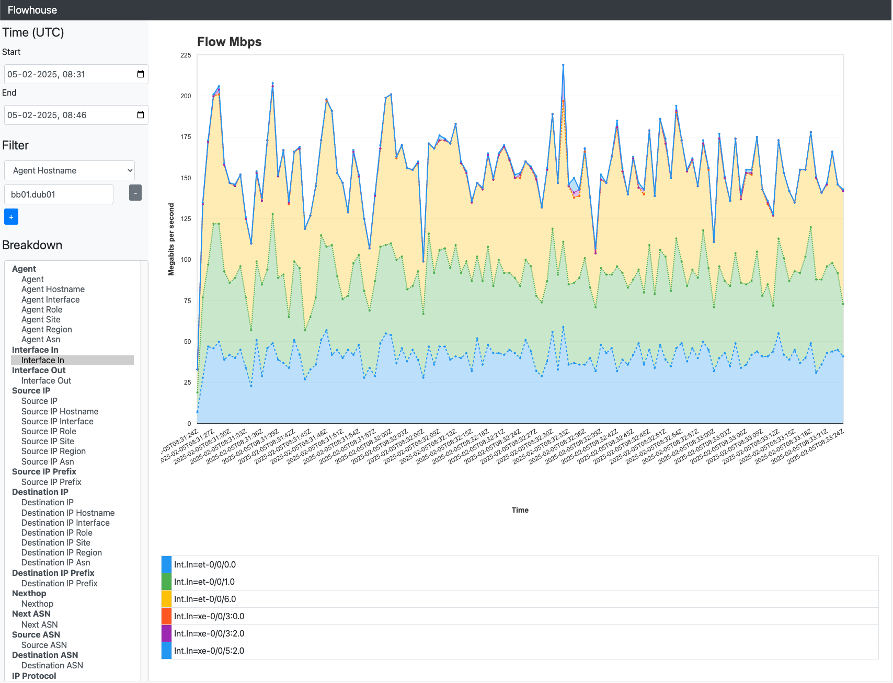

# flowhouse

Flowhouse is a [Clickhouse](https://clickhouse.tech/) based sFlow + IPFIX collector and web based analyzer that offers rich annotation and querying features.



## Interface Name Discovery

Discovery of interface names is supported using SNMP v2 and v3. The database always stores interface namens. Not IDs.

## Static Meta Data Annotations

Static meta data annotations are supported by the use of Clickhouse dicts.

`config.yaml` snippet:
```
dicts:
  - field: "agent"
    dict: "ip_addrs"
    expr: "tuple(IPv6NumToString(%s))"
  - field: "src_ip_addr"
    dict: "ip_addrs"
    expr: "tuple(IPv6NumToString(%s))"
  - field: "dst_ip_addr"
    dict: "ip_addrs"
    expr: "tuple(IPv6NumToString(%s))"
```

Enable dict on a clickhouse-server (extract from v24.12.3.47)
```
user@host ~ % cat /etc/clickhouse-server/config.d/ip_addrs_dictionary.xml 
<?xml version="1.0"?>
<clickhouse>
    <dictionary>
        <name>ip_addrs</name>
        <source>
            <file>
                <path>/etc/clickhouse-server/ips.csv</path>
                <format>CSV</format>
            </file>
        </source>
        <lifetime>300</lifetime>
        <layout>
                <complex_key_hashed>
                </complex_key_hashed>
        </layout>
        <structure>
            <key>
                <attribute>
                    <name>address</name>
                    <type>String</type>
                </attribute>
            </key>
            <attribute>
                <name>hostname</name>
                <type>String</type>
                <null_value>?</null_value>
            </attribute>
            <attribute>
                <name>interface</name>
                <type>String</type>
                <null_value>?</null_value>
            </attribute>
            <attribute>
                <name>role</name>
                <type>String</type>
                <null_value>?</null_value>
            </attribute>
            <attribute>
                <name>site</name>
                <type>String</type>
                <null_value>?</null_value>
            </attribute>
            <attribute>
                <name>region</name>
                <type>String</type>
                <null_value>?</null_value>
            </attribute>
            <attribute>
                <name>asn</name>
                <type>UInt32</type>
                <null_value>0</null_value>
            </attribute>
        </structure>
    </dictionary>
</clickhouse>
```

CSV for a dict:
```
user@host ~ % cat /etc/clickhouse-server/ips.csv
192.0.2.1,core01.pop01,et-0/0/0.0,backbone-router,FRA01,eu-central,4200001234
192.0.2.3,core02.pop02,et-0/0/1.0,backbone-router,FRA02,eu-central,4200001234
10.0.0.1,srv01,ens3,server,DUB01,eu-west,4200002947
```


## Dynamic Routing Meta Data Annotations

Dynamic routing meta data annotations like source and destination prefix, source, destination and nexthop ASN are supported
on the basis of the [BIO routing RIS](https://github.com/bio-routing/bio-rd/tree/master/cmd/ris).

## Installation
```go get github.com/bio-routing/flowhouse/cmd/flowhouse```

```go install github.com/bio-routing/flowhouse/cmd/flowhouse```

## Configuration

`config.yaml` example: [cmd/flowhouse/config.yaml](https://github.com/bio-routing/flowhouse/blob/master/cmd/flowhouse/config.yaml)


Format is defined here: [https://github.com/bio-routing/flowhouse/blob/master/cmd/flowhouse/config/config.go#L21](https://github.com/bio-routing/flowhouse/blob/master/cmd/flowhouse/config/config.go#L21)

## Running
```
user@host ~ % flowhouse --help
Usage of flowhouse:
  -config.file string
        Config file path (YAML) (default "config.yaml")
  -debug
        Enable debug logging
```
